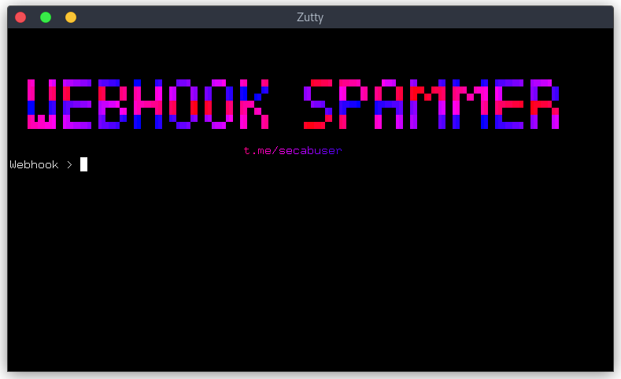

````markdown
# Discord Webhook Spammer 🇮🇷



---

## Features
- Fast & Multi-threaded
- Custom Username & Delay
- Clean Output with Results Summary
- Auto Retry on Rate-Limit

---

## Requirements
- Python 3.x or later.
- Required libraries:
  - `requests`
  - `user_agent`
  - `colorama`
  - `pystyle`

Install dependencies using:
```bash
pip install -r requirements.txt
````

---

## How to Use

### Linux

#### Step 1: Install Prerequisites

1. Verify Python 3.x is installed:

   ```bash
   python3 --version
   ```
2. If not installed:

   ```bash
   sudo apt update
   sudo apt install python3 python3-pip
   ```
3. Install required libraries:

   ```bash
   pip3 install requests user_agent colorama pystyle
   ```

#### Step 2: Run the Script

```bash
python3 main.py
```

#### Step 3: Provide Inputs

* Webhook URL
* Message to send
* Username (optional)
* Number of messages
* Number of threads
* Delay per message

#### Step 4: View Results

* See success count and elapsed time in a nice formatted table.

---

### Windows

#### Step 1: Install Python

* Download and install Python from [https://www.python.org/](https://www.python.org/)
* During install, make sure to **check** `Add Python to PATH`.

Verify installation:

```cmd
python --version
```

#### Step 2: Install Required Libraries

Open `cmd` and run:

```cmd
pip install requests user_agent colorama pystyle
```

#### Step 3: Run the Script

```cmd
python main.py
```

#### Step 4: Enter Info

Provide:

* Webhook URL
* Message content
* Optional username
* Number of messages to send
* Thread count
* Delay between sends

#### Step 5: Results

Tool will display results including success count and time taken.

---
